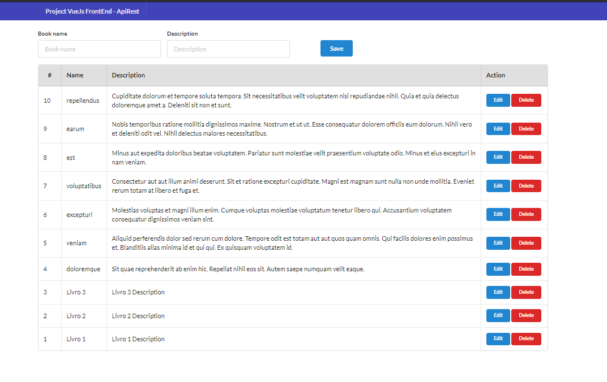

### Version PHP & Framework Used:
1. PHP-8
1. Laravel-9

### Architecture Used:
1. Laravel 9.x
1. Interface-Repository Pattern
1. Model Based Eloquent Query
1. Swagger API Documentation - https://github.com/DarkaOnLine/L5-Swagger
1. JWT Auth - https://github.com/tymondesigns/jwt-auth
1. PHP Unit Testing - Some basic unit testing added.

### API List:
##### Authentication Module
1. [x] Register User API with Token
1. [x] Login API with Token
1. [x] Authenticated User Profile
1. [x] Refresh Data
1. [x] Logout

##### Product Module
1. [x] Product List
1. [x] Product List [Public]
1. [x] Create Product
1. [x] Edit Product
1. [x] View Product
1. [x] Delete Product

### How to Run:
1. Clone Project - 

```bash
git clone https://github.com/andersonpfontes/crud-api-jwt-swagger.git
```
1. execute composer install --ignore-platform-reqs
2. Create `.env` file & Copy `.env.example` file to `.env` file
3. Create a database called - `test_softdesigner`.
4. Now migrate and seed database to complete-
``` bash
php artisan migrate:refresh --seed
```
It will create `21` Users and `103` Dummy Products.
5. Generate Swagger API
``` bash
php artisan l5-swagger:generate
```
6. Run the server -
``` bash
php artisan serve
```
7. Open Browser -
http://127.0.0.1:8000 & go to API Documentation -
http://127.0.0.1:8000/api/documentation
8. You'll see a Swagger Panel.


### Procedure
1. First Login with the given credential or any other user credential
1. Set bearer token to Swagger Header or Post Header as Authentication
1. Hit Any API, You can also hit any API, before authorization header data set to see the effects.


### Test
1. Test with Postman - https://www.getpostman.com/collections/9fd10d32e9b4d84a848b [Click to open with post man]
1. Test with Swagger.
1. Swagger Limitation: Image can not be uploaded throw Swagger, it can be uploaded throw Postman.
